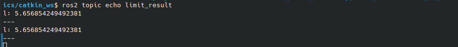

# Bellande Web ROS/ROS2 API

# [Bellande Step](https://github.com/RonaldsonBellande/bellande_robots_step)

# Images View of API Running

# ROS1 Launch
python3 bellande_limit_api.launch.py x1:=0 y1:=0 x2:=5 y2:=5 e1:=0 e2:=0 s1:=10 s2:=10 g1:=5 g2:=5 p1:=2 p2:=2 d1:=1 d2:=1 sr:=3 sp:=100
roslaunch application_api_bellande_limit bellande_limit_api.launch x1:=0 y1:=0 x2:=5 y2:=5 e1:=0 e2:=0 s1:=10 s2:=10 g1:=5 g2:=5 p1:=2 p2:=2 d1:=1 d2:=1 sr:=3 sp:=100

# ROS2 Launch
ros2 launch application_api_bellande_limit bellande_limit_api.launch.py x1:=0 y1:=0 x2:=5 y2:=5 e1:=0 e2:=0 s1:=10 s2:=10 g1:=5 g2:=5 p1:=2 p2:=2 d1:=1 d2:=1 sr:=3 sp:=100
