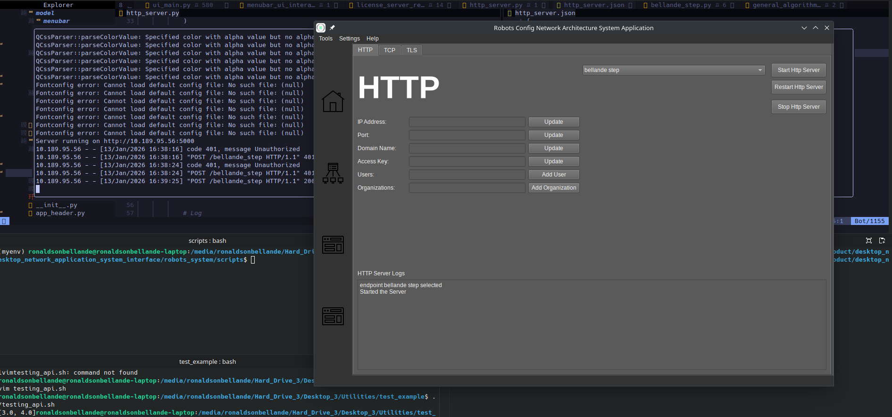

# Bellande Web ROS/ROS2 API

# [Bellande Step](https://github.com/Robotics-Sensors/bellande_step)

# Images View of API Running

# ROS1 Launch 
- python3 bellande_step_api.launch.py x1:=0 y1:=0 x2:=5 y2:=5 limit:=3
- roslaunch application_api_bellande_step bellande_step_api.launch x1:=0 y1:=0 x2:=5 y2:=5 limit:=3 

# ROS2 Launch
- ros2 launch application_api_bellande_step bellande_step_api.launch.py x1:=0 y1:=0 x2:=5 y2:=5 limit:=3
